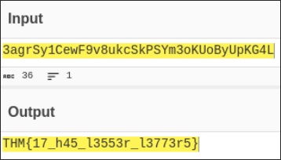

## Task 2
```bash
echo "VEhNe2p1NTdfZDNjMGQzXzdoM19iNDUzfQ==" | base64 -d
THM{ju57_d3c0d3_7h3_b453}
```

## Task 3
```bash
exiftool Find_me_1577975566801.jpg | grep THM
Owner Name                      : THM{3x1f_0r_3x17}
```

## Task 4
```bash
steghide extract -sf Extinction_1577976250757.jpg 
stegseek Extinction_1577976250757.jpg /usr/share/wordlists/rockyou.txt.gz
cat Extinction_1577976250757.jpg.out
It going to be over soon. Sleep my child.

THM{500n3r_0r_l473r_17_15_0ur_7urn}
```

## Task 5
Litteraly in the question 
```
THM{wh173_fl46}
```

## Task 6
Just scan the qr code
```
THM{qr_m4k3_l1f3_345y}
```

## Task 7
```bash
strings hello_1577977122465.hello | grep THM
THM{345y_f1nd_345y_60}
```

### Alternatively
Open the binary with ghidra


## Task 8
```bash
echo 3agrSy1CewF9v8ukcSkPSYm3oKUoByUpKG4L | base58 -d
THM{17_h45_l3553r_l3773r5}
```

### Alternatively
Use cyberchef's magic tool to found out



## Task 9
ROT 7
[cypher-cracker](https://github.com/Ruohao1/cypher-cracker)
```bash
PYTHONPATH=src/ python -m src.cli --caesar "MAF{atbe_max_vtxltk}"

k=19 score=-43.60 -> THM{hail_the_caesar}
```


## Task 10 
Inspect the element


## Task 11
```bash
cp spoil_157979329740.png fixed.png
printf '\x89\x50\x4E\x47' | dd of=fixed.png bs=1 seek=0 count=4 conv=notrunc
```


## Task 12

[reddit](https://www.reddit.com/r/tryhackme/comments/eizxaq/new_room_coming_soon/)

## Task 13


## Task 14
```python
s1 = bytes.fromhex("44585d6b2368737c65252166234f20626d")
pt = bytes(b ^ 0x10 for b in s1)
print(pt.decode())
```

## Task 15
```bash
binwalk hell_1578018688126.jpg -e
cd _hell_1578018688127.jpg.extracted
cat hello_there.txt
Thank you for extracting me, you are the best!

THM{y0u_w4lk_m3_0u7}
```

## Task 16
```python
import numpy as np
from PIL import Image

img = np.array(Image.open("dark.png"))
lsb = img & 1  # keep only least significant bit
Image.fromarray((lsb[:,:,0]*255).astype(np.uint8)).save("lsb_r.png")
Image.fromarray((lsb[:,:,1]*255).astype(np.uint8)).save("lsb_g.png")
Image.fromarray((lsb[:,:,2]*255).astype(np.uint8)).save("lsb_b.png")
```
lsb_b


## Task 17
Just scan the qr and listen
```
THM{SOUNDINGQR}
```

## Task 18
Use wayback machine on 2 jan 2020


## Task 19
[cypher-cracker](https://github.com/Ruohao1/cypher-cracker)
```bash
$ PYTHONPATH=src/ python -m src.cli --vigenere "MYKAHODTQ{RVG_YVGGK_FAL_WXF}" -k TRYHACKME
Key provided: TRYHACKME
Decrypted: THMTHMTHM{YEI_RVEWY_BHU_YQF}

$ PYTHONPATH=src/ python -m src.cli --vigenere "MYKAHODTQ{RVG_YVGGK_FAL_WXF}" -k THM     
Key provided: THM
Decrypted: TRYHACKME{YOU_FOUND_THE_KEY}
```

### Alternative
![[vigenere.png]]

## Task 20
```bash
python -c 'n=int("581695969015253365094191591547859387620042736036246486373595515576333693");print(n.to_bytes((n.bit_length()+7)//8,"big").decode())'

THM{17_ju57_4n_0rd1n4ry_b4535}
```

## Task 21

```bash
$ tshark -r flag_1578026731881.pcapng -Y http.request -T fields -e tcp.stream -e http.request.uri
27	/
29	/
27	/
27	/
29	/
42	/flag.txt

$ tshark -r flag_1578026731881.pcapng -Y "tcp.stream==42 && tcp" -T fields -e http.file_data | xxd -r -p | strings

THM{d0_n07_574lk_m3}
Found me!
```

